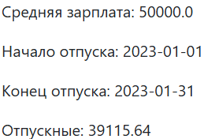

# Приложение "Калькулятор отпускных".

Приложение принимает твою среднюю зарплату за 12 месяцев и количество дней отпуска - отвечает суммой отпускных, 
которые придут сотруднику. 

При запросе также можно указать точные дни ухода в отпуск, тогда должен проводиться рассчет отпускных 
с учётом праздников и выходных.

## О приложении
Реализованы следующие запросы:
* **GET /calculate**: вычисление отпускных на основе средней зарплаты за 12 месяцев и количества дней отпуска. Возвращает сумму отпускных
* **GET /calculate/range**: вычисление отпускных на основе средней зарплаты за 12 месяцев, а также дат начала и окончания отпуска. Возвращает сумму отпускных

## Инструкция по запуску приложения
1. Добавить репозиторий в свою IDE (скачать/клонировать)
2. При необходимости перезагрузить проект(ПКМ по названию проекта -> Maven -> Reload project)
3. Запустить [SpringWebCalculateVacationPayApplication.java](src/main/java/com/neoflex/calculateVacationPay/SpringWebCalculateVacationPayApplication.java)
4. Приложение расположено на локальном адресе: http://localhost:5434/app/

## Примеры работы приложения
1. Расчёт отпускных при помощи количества дней

Входные данные:
* средняя зарплата: 29400
* кол-во дней отпуска: 5

Результат:

2. Расчёт отпускных при помощи дат начала и окончания отпуска

Входные данные:
* средняя зарплата: 50000
* Дата начала отпуска: 01.01.2023
* Дата окончания отпуска: 31.01.2023

Результат:

